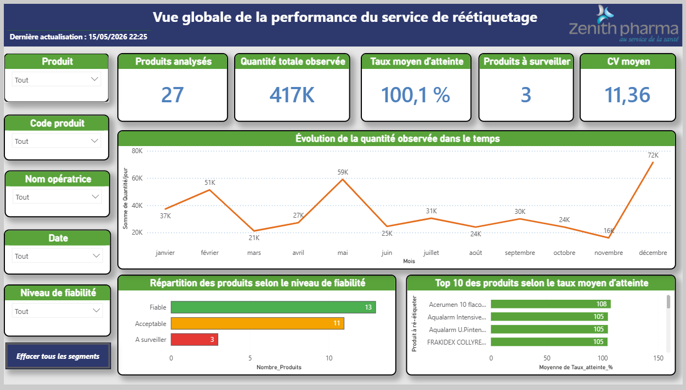
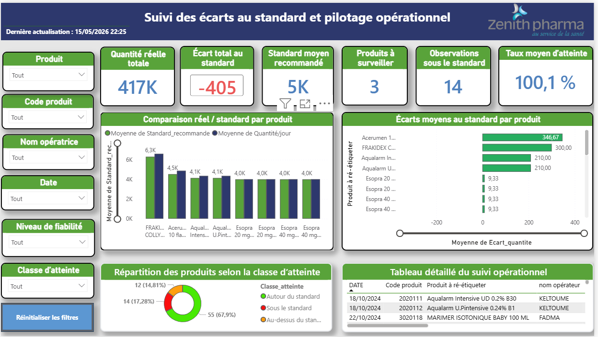
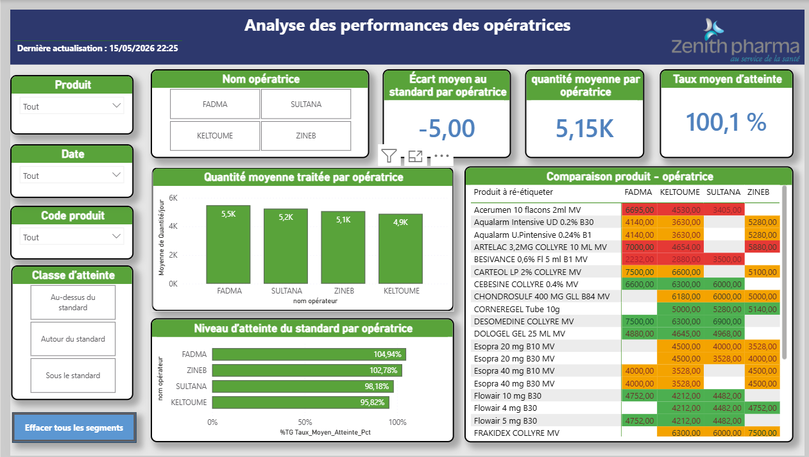

# Zenith Pharma KPI Dashboard

## Contexte
Projet Business Intelligence réalisé dans le cadre d’un stage chez Zenith Pharma au sein du service logistique / réétiquetage pharmaceutique.

## Objectif
Analyser la performance opérationnelle et construire des KPI afin d’améliorer le pilotage des opérations logistiques.

## Outils utilisés
- Power BI
- Python
- Pandas
- Excel
- Data Analytics

## KPI analysés
- Taux d’atteinte du standard
- Écart au standard
- Coefficient de variation
- Quantité moyenne
- Régularité de performance

## Méthodologie
1. Nettoyage des données
2. Analyse des données opérationnelles
3. Construction des KPI
4. Visualisation Power BI
5. Analyse des écarts
6. Recommandations opérationnelles

## Résultats
- Meilleure visibilité managériale
- Centralisation des KPI
- Dashboard interactif
- Support à la prise de décision
## Dashboard

